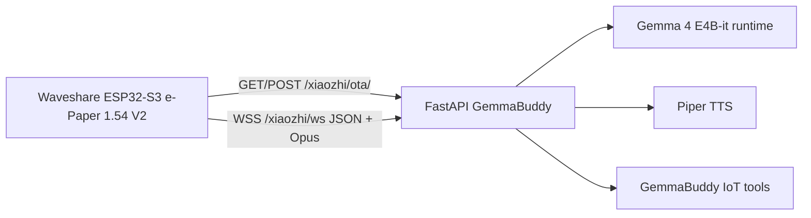

# GemmaBuddy Architecture

GemmaBuddy keeps the ESP-IDF firmware protocol compatible with XiaoZhi devices while replacing the official service dependency with a self-hosted backend.

The `/xiaozhi/*` path is retained only as a firmware compatibility surface. Product copy, docs, runtime logs, and deployment names are GemmaBuddy.

No official XiaoZhi service is required.
